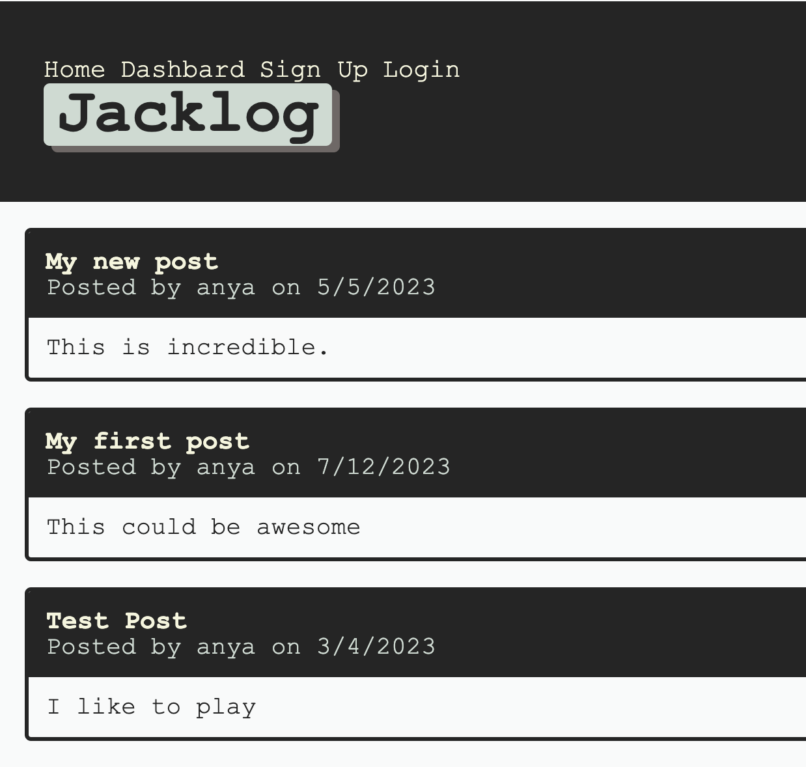
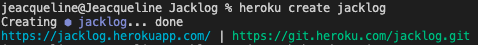

# Jacklog

This is a simple blog application where users can create and publish blog posts. It allows users to register, log in, and manage their posts.
I used the following files as a guide:
- TDM-VIRT-FSF-PT-10-2022-U-LOLC/01-Activities/28,25,24,26,19,20

## Features
- User Registration: Users can create an account to access the application.
- Login: Registered users can log in to the application.
- Post Creation: Users can create and publish new blog entries.
- Post Editing and Deletion: Users can edit and delete their own posts.
- Post Viewing: Users can view existing posts on the homepage.
- Post Details: Users can click on a post to view the full details.

## Technologies Used
* Node.js
* Express.js
* Sequelize (ORM)
* MySQL (database)
* HTML/CSS

## Installation
- Clone the repository: git clone git@github.com:Jeacqueline/Jacklog.git
- Navigate to the project directory: cd jacklog
- Install the dependencies: npm install
- Configure the database: mysql -u root -p
- Create a MySQL database.
- Rename the .env.example file to .env and configure the - environment variables related to the database.

## Usage
Start the application: npm start
Access the application in your browser: http://localhost:3000

[Repository Jacklog](https://github.com/Jeacqueline/Jacklog)

[Heroku Jacklog](https://jacklog.herokuapp.com/)
